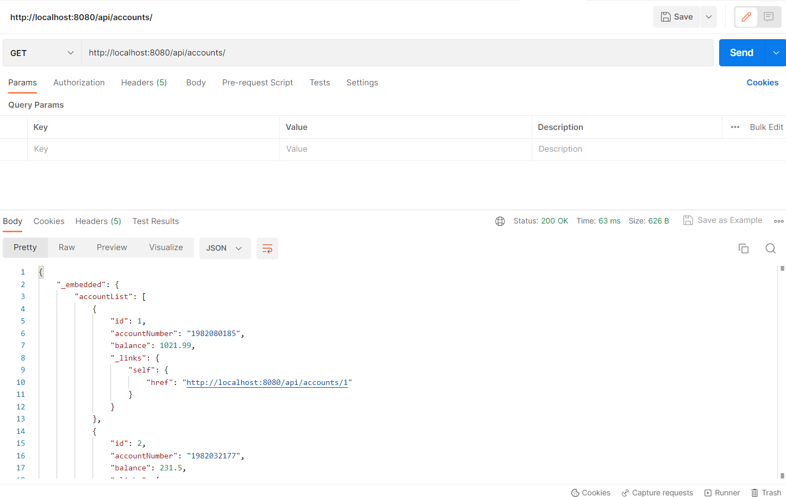
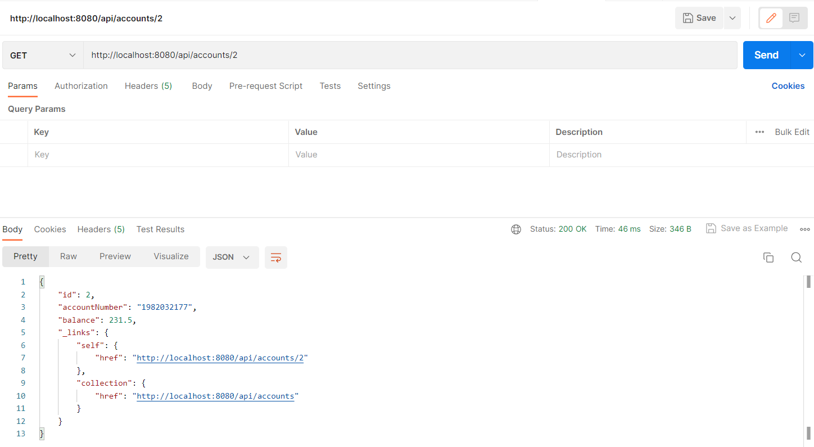
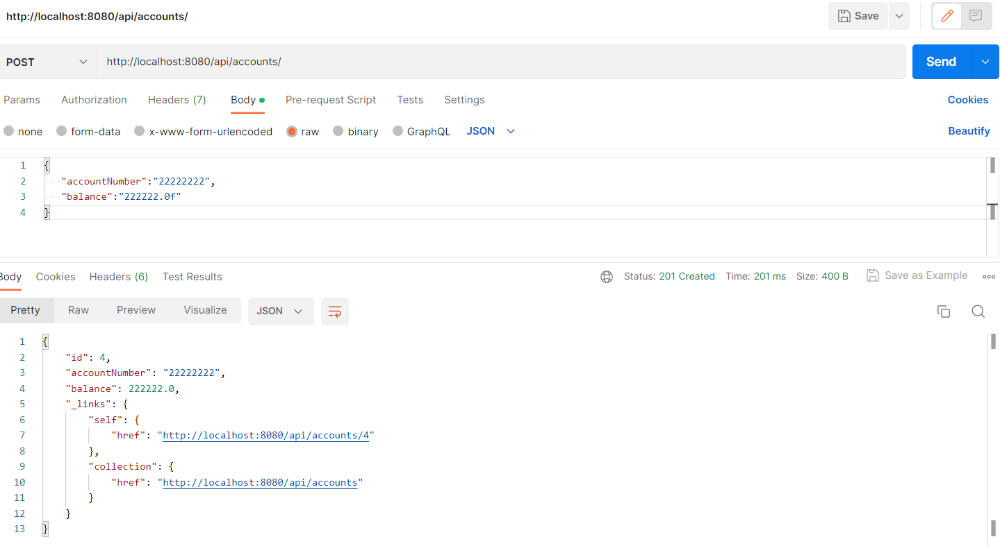
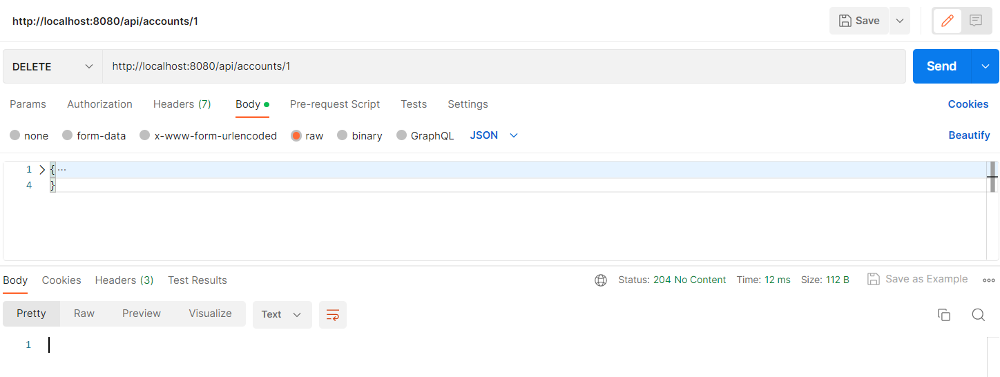
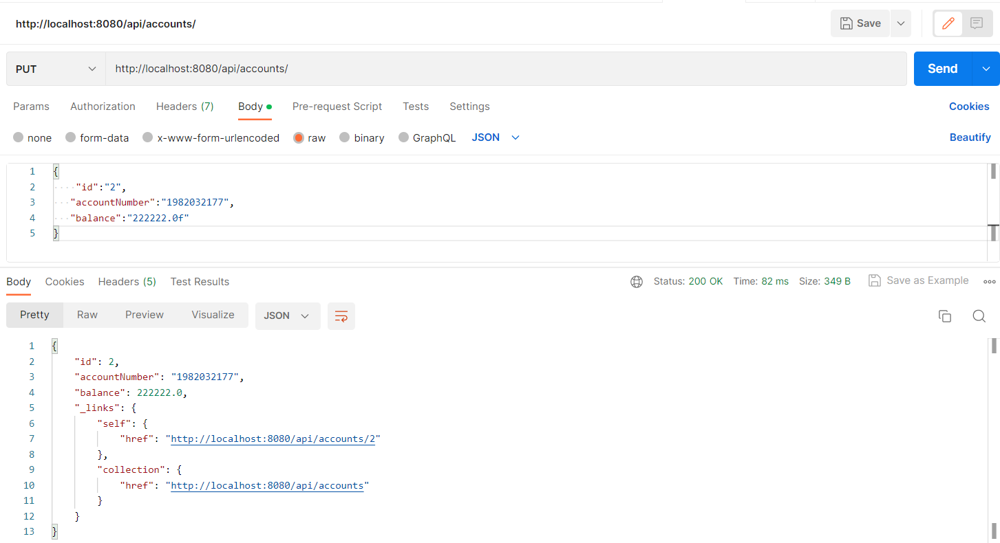

### GET
http://localhost:8080/api/accounts/

### POST
http://localhost:8080/api/accounts/

### DELETE
http://localhost:8080/api/accounts/1

### PUT
http://localhost:8080/api/accounts/

### PATCH

